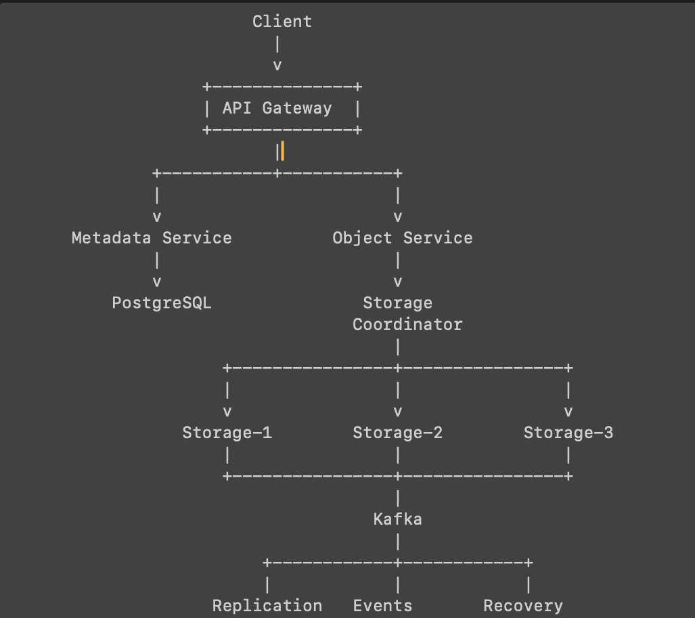

MicroServices Project - MiniS3 — Distributed Object Storage System:

Excellent choice. Distributed Storage / Mini S3 should become your flagship systems project.
The key is to build it as a real distributed storage system, not just a file-upload application.
Project definition
Project name: MiniS3 — Distributed Object Storage System
Core goal: Build a simplified S3-like platform that can store, retrieve, replicate, and manage objects across multiple storage nodes.
Recommended architecture

Features we'll build
Phase 1 — Basic storage
* Upload object
* Download object
* Delete object
* Object metadata
* Bucket creation
* Bucket listing
  Phase 2 — Distributed storage
* Multiple storage nodes
* Storage-node registration
* Object placement
* Replication
* Node health checks
  Phase 3 — Fault tolerance
* Heartbeats
* Failure detection
* Retry
* Replica recovery
* Automatic re-replication
  Phase 4 — Performance
* Redis metadata cache
* Chunked uploads
* Parallel transfers
* Connection pooling
  Phase 5 — Event-driven architecture
* Kafka
* ObjectUploaded
* ObjectDeleted
* ReplicationRequired
* NodeFailed
* ReplicationCompleted
  Phase 6 — Observability
* Spring Boot Actuator
* Prometheus
* Grafana
* Request latency
* Storage-node health
* Replication metrics
* Error rates
  Phase 7 — Infrastructure
* Docker
* Docker Compose
* Kubernetes
* Persistent volumes
* Horizontal scaling
  Technology stack
  Layer	Technology
  Backend	Java + Spring Boot
  API	REST
  Database	PostgreSQL
  Cache	Redis
  Messaging	Kafka
  Storage	Local filesystem initially
  Containers	Docker
  Orchestration	Kubernetes
  Monitoring	Prometheus + Grafana
  Testing	JUnit + Testcontainers
  Cloud later	AWS
  Most important engineering concepts
  This project should specifically teach you:
  ReplicationHow many copies of an object exist?
  ConsistencyWhat happens when one replica is updated but another isn't?
  Fault toleranceWhat happens when Storage Node 2 suddenly disappears?
  ConcurrencyWhat happens when 100 users upload files simultaneously?
  Data placementWhich storage node should receive a new object?
  IdempotencyWhat happens when the same upload request arrives twice?
  RecoveryHow does the system rebuild a missing replica?
  These are the parts that make this project valuable for your FAANG preparation.
  Development order
  Don't start with Kafka/Kubernetes on day one.
  Build it in this order:
1. Single-node object storage
   ↓
2. Metadata service
   ↓
3. Multiple storage nodes
   ↓
4. Replication
   ↓
5. Failure detection
   ↓
6. Recovery / re-replication
   ↓
7. Redis
   ↓
8. Kafka
   ↓
9. Prometheus + Grafana
   ↓
10. Docker
    ↓
11. Kubernetes
    ↓
12. AWS deployment
    That gives us a very clear learning progression.
    Final resume version
    Once completed, a strong version could eventually read:
    MiniS3 — Distributed Object Storage System: Built a distributed S3-like object storage platform using Java/Spring Boot with multi-node replication, fault detection and recovery, Kafka-based asynchronous events, Redis caching, PostgreSQL metadata management, Prometheus/Grafana observability, and Docker/Kubernetes deployment.
    That is substantially stronger than simply saying "Built a Spring Boot file-upload application."
    Next, we should start with Phase 1: designing the MiniS3 architecture and repository structure before writing code.
